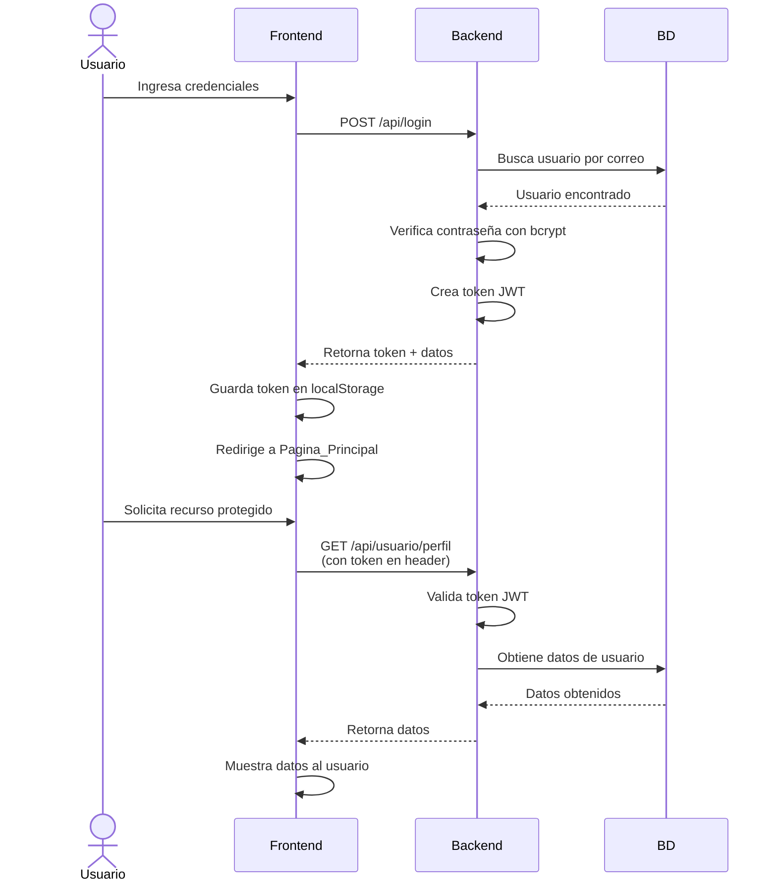

# 📋 Resumen de Cambios - TechnoPets 2.0

**Fecha:** 2026-06-16  
**Estado:** ✅ Sistema de autenticación implementado

---

## 🎯 Cambios Realizados

### 1. **Backend (Python/Flask)**

#### ✅ Mejorado: `Backend/app.py`
- Agregado CORS (Flask-CORS) para solicitudes cross-origin
- Implementado sistema de tokens JWT
- Nuevo endpoint `/api/login` con validación de credenciales
- Mejorado endpoint `/api/registro` con validaciones robustas
- Nuevo endpoint `/api/usuario/perfil` (protegido)
- Nuevo endpoint `/api/validar-token` (protegido)
- Decorador `@token_requerido` para proteger rutas
- Funciones de validación de email y teléfono
- Mejor manejo de errores con códigos HTTP apropiados

#### ✅ Actualizado: `Control/basededatospy.py`
- Nueva tabla `usuario` con campos:
  - `id_usuario` (PK)
  - `correo` (UNIQUE)
  - `contrasena` (hasheada con bcrypt)
  - `rol` (cliente, veterinario, recepcionista, admin)
  - `id_dueno` (FK)
  - `activo`
  - `fecha_creacion`

- Nuevas funciones:
  - `registrar_usuario()` - Hash de contraseña con Werkzeug
  - `validar_usuario()` - Verificación segura de credenciales
  - `obtener_usuario_por_id()` - Obtiene datos de usuario
  - `verificar_correo_existe()` - Evita duplicados

### 2. **Frontend (JavaScript)**

#### ✅ Actualizado: `Vista/js/Inicio_de_sesion.js`
- Login ahora usa `/api/login` en lugar de localStorage
- Registro ahora usa `/api/registro` con validaciones backend
- Tokens se guardan seguramente en localStorage
- Mejor manejo de errores con mensajes del servidor

#### ✅ Nuevo: `Vista/js/auth.js`
- Sistema completo de autenticación reutilizable
- Funciones para:
  - Obtener y guardar tokens
  - Manejar datos de usuario
  - Realizar solicitudes autenticadas
  - Verificar autorización por rol
  - Actualizar UI según autenticación
  - Redirigir a login si token expira

### 3. **Configuración y Documentación**

#### ✅ Nuevo: `requirements.txt`
```
Flask==2.3.0
Flask-CORS==4.0.0
PyJWT==2.8.0
Werkzeug==2.3.0
```

#### ✅ Nuevo: `API_DOCUMENTATION.md`
- Documentación completa de todos los endpoints
- Ejemplos de solicitudes y respuestas
- Guía de uso de tokens JWT
- Notas de seguridad

---

## 🔐 Mejoras de Seguridad

| Antes | Ahora |
|-------|-------|
| Contraseña en texto plano | Hasheadas con bcrypt |
| Login solo en cliente (localStorage) | Validación en servidor |
| Sin tokens | Tokens JWT de 24 horas |
| Sin CORS | CORS configurado |
| Validaciones solo frontend | Validaciones frontend + backend |
| Sin autorización | Sistema de roles implementado |

---

## 📊 Flujo de Autenticación



---

## 🚀 Próximos Pasos Recomendados

### Fase 2 - Endpoints de Mascotas y Citas
- [ ] `GET /api/mascotas` - Listar mascotas del usuario
- [ ] `POST /api/mascotas` - Crear nueva mascota
- [ ] `GET /api/citas` - Listar citas
- [ ] `POST /api/citas/agendar` - Agendar cita
- [ ] `PUT /api/citas/{id}` - Modificar cita

### Fase 3 - Endpoints por Rol
- [ ] Endpoints de veterinario (ver citas, registrar consultas)
- [ ] Endpoints de recepcionista (gestionar agenda)
- [ ] Endpoints de admin (gestionar usuarios)

### Fase 4 - Funcionalidades Avanzadas
- [ ] Refresh tokens para mejor seguridad
- [ ] Recuperación de contraseña
- [ ] Confirmación de email
- [ ] Autenticación de dos factores
- [ ] Logs de actividad

---

## 🧪 Pruebas Rápidas

### 1. Registrar un nuevo usuario
```bash
curl -X POST http://127.0.0.1:5000/api/registro \
  -H "Content-Type: application/json" \
  -d '{
    "nombre": "Juan Pérez",
    "correo": "juan@example.com",
    "telefono": "3215551234",
    "contrasena": "Password123",
    "direccion": "Calle 45 No. 23",
    "mascotas": [{
      "nombre": "Max",
      "especie": "perro",
      "raza": "Labrador",
      "edad": 3,
      "sexo": "macho",
      "peso": "25kg"
    }]
  }'
```

### 2. Hacer login
```bash
curl -X POST http://127.0.0.1:5000/api/login \
  -H "Content-Type: application/json" \
  -d '{
    "correo": "juan@example.com",
    "contrasena": "Password123"
  }'
```

### 3. Usar token para acceder a ruta protegida
```bash
# Reemplazar TOKEN con el token obtenido en login
curl -X GET http://127.0.0.1:5000/api/usuario/perfil \
  -H "Authorization: Bearer TOKEN" \
  -H "Content-Type: application/json"
```

---

## 📝 Cambios en Frontend

Para usar autenticación en tus páginas HTML, incluye `auth.js`:

```html
<script src="/Vista/js/auth.js"></script>
```

Luego puedes usar:

```javascript
// Inicializar página (requiere autenticación)
inicializarAutenticacion();

// Obtener datos del usuario
const usuario = obtenerUsuario();
console.log('Usuario:', usuario.correo, usuario.rol);

// Hacer solicitud autenticada
const datos = await llamarAPI('/usuario/perfil');
console.log(datos);

// Logout
eliminarToken();
```

---

## ⚠️ Importante

1. **Cambio de Endpoint:** El registro ahora usa `/api/registro` en lugar de `/registro`
2. **Token Requerido:** Las rutas protegidas necesitan el header `Authorization: Bearer <token>`
3. **Roles:** Por defecto, nuevos usuarios se crean con rol `'cliente'`
4. **Expiración:** Los tokens expiran después de 24 horas

---

## 🔗 Archivos Modificados

```
Backend/
  ✏️ app.py (completamente reescrito)
Control/
  ✏️ basededatospy.py (agregadas funciones y tabla)
Vista/
  js/
    ✏️ Inicio_de_sesion.js (actualizado con API)
    ✨ auth.js (nuevo - sistema de autenticación)
✨ requirements.txt (nuevo - dependencias)
✨ API_DOCUMENTATION.md (nuevo - documentación)
✨ CAMBIOS.md (este archivo)
```

---

¡Sistema de autenticación completamente funcional! 🎉
