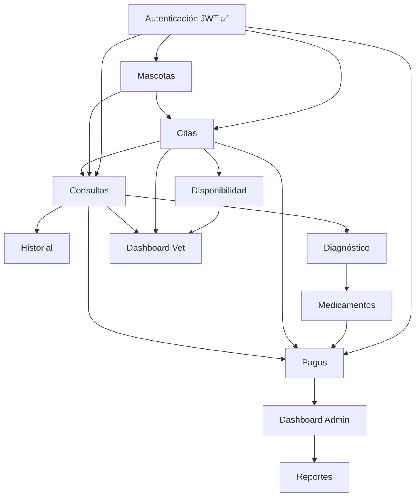

# 📋 INFORME DETALLADO: TechnoPets 2.0 - Análisis de Completitud

**Fecha:** 16 de junio de 2026  
**Versión del proyecto:** 2.0  
**Estado general:** ⚠️ **40% COMPLETADO** (Sistema de autenticación implementado, resto pendiente)

---

## 📊 RESUMEN EJECUTIVO

El proyecto TechnoPets 2.0 tiene la **estructura base implementada**, pero le falta el **80% de la funcionalidad real** para ser un sistema operativo completo. Principalmente:

- ✅ **Completado**: Autenticación (JWT), estructura de BD, interfaz de usuario
- ❌ **Pendiente**: Endpoints REST, lógica de negocio, integración frontend-backend, roles, validaciones complejas
- 🔴 **Crítico**: Sin endpoints de citas, consultas, historial médico, pagos

---

## 1️⃣ ENDPOINTS REST PENDIENTES

### Estado Actual
**Implementados:** 5 endpoints  
**Faltantes:** ~45 endpoints

### A. ENDPOINTS DE MASCOTAS ❌
| Endpoint | Método | Estado | Prioridad | Dependencias |
|----------|--------|--------|-----------|--------------|
| `/api/mascotas` | GET | ❌ Falta | 🔴 Crítico | BD:mascota |
| `/api/mascotas/<id>` | GET | ❌ Falta | 🔴 Crítico | BD:mascota |
| `/api/mascotas` | POST | ❌ Falta | 🔴 Crítico | Auth, BD:mascota |
| `/api/mascotas/<id>` | PUT | ❌ Falta | 🟡 Importante | Auth, BD:mascota |
| `/api/mascotas/<id>` | DELETE | ❌ Falta | 🟡 Importante | Auth, BD:mascota |
| `/api/mascotas/<id>/alergias` | GET | ❌ Falta | 🟡 Importante | BD:alergia |
| `/api/mascotas/<id>/alergias` | POST | ❌ Falta | 🟡 Importante | Auth, BD:alergia |

### B. ENDPOINTS DE CITAS ❌
| Endpoint | Método | Estado | Prioridad | Responsable |
|----------|--------|--------|-----------|------------|
| `/api/citas` | GET | ❌ Falta | 🔴 Crítico | Veterinario/Recepcionista |
| `/api/citas` | POST | ❌ Falta | 🔴 Crítico | Cliente/Recepcionista |
| `/api/citas/<id>` | GET | ❌ Falta | 🔴 Crítico | Propietario/Vet |
| `/api/citas/<id>` | PUT | ❌ Falta | 🟡 Importante | Recepcionista/Vet |
| `/api/citas/<id>` | DELETE | ❌ Falta | 🟡 Importante | Recepcionista/Admin |
| `/api/citas/<id>/estado` | PATCH | ❌ Falta | 🔴 Crítico | Recepcionista |
| `/api/citas/disponibilidad` | GET | ❌ Falta | 🔴 Crítico | Sistema de agenda |
| `/api/citas/<id>/cancelar` | POST | ❌ Falta | 🟡 Importante | Cliente/Recepcionista |

### C. ENDPOINTS DE CONSULTAS Y DIAGNÓSTICO ❌
| Endpoint | Método | Estado | Prioridad |
|----------|--------|--------|-----------|
| `/api/consultas` | GET | ❌ Falta | 🔴 Crítico |
| `/api/consultas` | POST | ❌ Falta | 🔴 Crítico |
| `/api/consultas/<id>` | GET | ❌ Falta | 🔴 Crítico |
| `/api/diagnosticos` | GET | ❌ Falta | 🟡 Importante |
| `/api/diagnosticos` | POST | ❌ Falta | 🟡 Importante |
| `/api/tratamientos` | GET | ❌ Falta | 🟡 Importante |
| `/api/tratamientos` | POST | ❌ Falta | 🟡 Importante |

### D. ENDPOINTS DE HISTORIAL MÉDICO ❌
| Endpoint | Método | Estado | Prioridad |
|----------|--------|--------|-----------|
| `/api/mascotas/<id>/historial` | GET | ❌ Falta | 🔴 Crítico |
| `/api/mascotas/<id>/historial/exámenes` | GET | ❌ Falta | 🟡 Importante |
| `/api/mascotas/<id>/historial/cirugías` | GET | ❌ Falta | 🟡 Importante |
| `/api/mascotas/<id>/historial/vacunaciones` | GET | ❌ Falta | 🟡 Importante |

### E. ENDPOINTS DE FARMACIA Y MEDICAMENTOS ❌
| Endpoint | Método | Estado | Prioridad |
|----------|--------|--------|-----------|
| `/api/medicamentos` | GET | ❌ Falta | 🟡 Importante |
| `/api/medicamentos` | POST | ❌ Falta | 🟡 Importante |
| `/api/medicamentos/<id>` | GET | ❌ Falta | 🟡 Importante |
| `/api/mascotas/<id>/medicamentos` | GET | ❌ Falta | 🟡 Importante |

### F. ENDPOINTS DE PAGOS Y FACTURACIÓN ❌
| Endpoint | Método | Estado | Prioridad |
|----------|--------|--------|-----------|
| `/api/pagos` | GET | ❌ Falta | 🟡 Importante |
| `/api/pagos` | POST | ❌ Falta | 🟡 Importante |
| `/api/facturas/<id>` | GET | ❌ Falta | 🟡 Importante |
| `/api/facturas` | GET | ❌ Falta | 🟡 Importante |

### G. ENDPOINTS DE USUARIOS Y ROLES ❌
| Endpoint | Método | Estado | Prioridad |
|----------|--------|--------|-----------|
| `/api/usuarios` | GET | ❌ Falta | 🟡 Importante |
| `/api/usuarios` | POST | ❌ Falta | 🟡 Importante |
| `/api/usuarios/<id>` | GET | ❌ Falta | 🟡 Importante |
| `/api/usuarios/<id>` | PUT | ❌ Falta | 🟡 Importante |
| `/api/usuarios/<id>/rol` | PATCH | ❌ Falta | 🔴 Crítico |
| `/api/usuarios/<id>/cambiar-password` | POST | ❌ Falta | 🟡 Importante |

### H. ENDPOINTS DE ADMINISTRACIÓN ❌
| Endpoint | Método | Estado | Prioridad |
|----------|--------|--------|-----------|
| `/api/estadísticas/clínica` | GET | ❌ Falta | 🟢 Mejora |
| `/api/reportes/citas` | GET | ❌ Falta | 🟢 Mejora |
| `/api/reportes/ingresos` | GET | ❌ Falta | 🟢 Mejora |

### I. ENDPOINTS DE DUEÑOS ❌
| Endpoint | Método | Estado | Prioridad |
|----------|--------|--------|-----------|
| `/api/duenos/<id>` | GET | ❌ Falta | 🔴 Crítico |
| `/api/duenos/<id>` | PUT | ❌ Falta | 🟡 Importante |
| `/api/duenos/<id>/mascotas` | GET | ❌ Falta | 🔴 Crítico |

---

## 2️⃣ FUNCIONALIDADES DE FRONTEND

### Página: Pagina_Principal.html
- ✅ Estructura HTML base
- ✅ Links a otros servicios
- ❌ **NO conectada al backend**
- ❌ No carga datos dinámicos
- ❌ No valida autenticación
- ❌ Perfil de usuario no se actualiza

**Acciones faltantes:**
- [ ] Integrar con `/api/usuario/perfil`
- [ ] Mostrar mascotas del usuario
- [ ] Mostrar citas próximas
- [ ] Cargar servicios disponibles de base de datos

### Página: Inicio_de_sesion.html
- ✅ Formulario multistep implementado
- ✅ Validaciones frontend
- ✅ Conectado a `/api/login` y `/api/registro`
- ❌ No valida disponibilidad de servicios
- ❌ Mensajes de error genéricos
- ❌ No hay recuperación de contraseña

**Acciones faltantes:**
- [ ] Endpoint de recuperación de contraseña
- [ ] Verificación de correo duplicado en tiempo real
- [ ] Validación de teléfono mejorada

### Página: Consulta_y_medicina_preventiva.html
- ✅ UI diseñada (multistep)
- ❌ **NO tiene backend**
- ❌ No obtiene disponibilidad de citas
- ❌ No envía datos de cita al servidor
- ❌ No valida mascota pertenece al usuario

**Acciones faltantes:**
- [ ] Cargar mascotas del usuario autenticado
- [ ] Obtener disponibilidad de veterinarios
- [ ] Validar fecha/hora disponibles
- [ ] POST a `/api/citas` (no implementado)
- [ ] Confirmación de cita con código

### Página: Diagnostico_y_examenes.html
- ❌ **VACÍA**
- ❌ No hay conexión a datos
- ❌ No hay lógica de filtrado

**Acciones faltantes:**
- [ ] Cargar historial de consultas del usuario
- [ ] Mostrar diagnósticos por mascota
- [ ] Mostrar exámenes con resultados
- [ ] Visualizar historiales médicos

### Página: Farmacia_y_medicacion.html
- ❌ **VACÍA**
- ❌ No hay catálogo de medicamentos
- ❌ No hay carrito de compras

**Acciones faltantes:**
- [ ] Cargar medicamentos disponibles
- [ ] Filtrar por tipo de animal
- [ ] Mostrar medicamentos recetados
- [ ] Sistema de carrito y checkout

### Página: Cuidado_especializado.html
- ❌ **VACÍA**
- ❌ No hay descripción de servicios
- ❌ No hay agendamiento

**Acciones faltantes:**
- [ ] Listar servicios especializados
- [ ] Mostrar precios
- [ ] Agendamiento de procedimientos

### Página: Otros_servicios_adicionales.html
- ❌ **VACÍA**
- ❌ No hay catálogo de servicios

**Acciones faltantes:**
- [ ] Listar servicios adicionales (grooming, etc.)
- [ ] Agendamiento

### Dashboard Veterinario (`roles/Veterinario/Veterinario.html`)
- ✅ UI diseñada
- ❌ **NO tiene backend**
- ❌ No obtiene citas asignadas
- ❌ No carga datos de pacientes
- ❌ No guarda notas de consulta

**Acciones faltantes:**
- [ ] GET `/api/citas` (filtrado por veterinario)
- [ ] GET `/api/consultas/<id>`
- [ ] PUT `/api/consultas/<id>` (guardar notas)
- [ ] PATCH `/api/citas/<id>/estado` (cambiar estado)

### Dashboard Recepcionista (`roles/Recepcionista/Recepcionista.html`)
- ❌ **VACÍO/NO IMPLEMENTADO**

**Acciones faltantes:**
- [ ] Crear página de recepcionista
- [ ] Listar todas las citas del día
- [ ] Filtros por estado, veterinario
- [ ] Cambiar estado de citas
- [ ] Registrar llegadas
- [ ] Cobro de servicios

### Dashboard Administrador (`roles/Administrador/Administrador.html`)
- ❌ **VACÍO/NO IMPLEMENTADO**

**Acciones faltantes:**
- [ ] Crear página de administrador
- [ ] Gestión de usuarios
- [ ] Gestión de veterinarios
- [ ] Reportes y estadísticas
- [ ] Configuración de horarios

---

## 3️⃣ LÓGICA DE NEGOCIO NO IMPLEMENTADA

### A. Sistema de Citas ❌
**Crítico para funcionamiento básico**

**Falta:**
1. **Disponibilidad de citas**
   - [ ] Sistema de slots horarios
   - [ ] Cálculo de disponibilidad por veterinario
   - [ ] Manejo de capacidad (4 citas de 30 min en 2 horas)
   - [ ] Bloqueo de horarios (almuerzo, etc.)
   
2. **Reserva de citas**
   - [ ] Validar que mascota pertenece al usuario
   - [ ] Validar disponibilidad en tiempo real
   - [ ] Crear registro en BD
   - [ ] Generar código de confirmación
   - [ ] Enviar confirmación por email/SMS
   
3. **Gestión de citas**
   - [ ] Cambio de cita
   - [ ] Cancelación con multa
   - [ ] No-show (no asistencia)
   - [ ] Recordatorios automáticos
   - [ ] Historial de citas

### B. Consultas Médicas ❌
**Crítico para uso veterinario**

**Falta:**
1. **Crear consulta**
   - [ ] Asociar a cita
   - [ ] Registrar veterinario
   - [ ] Capturar datos vitales (temperatura, peso, presión)
   - [ ] Registrar síntomas/quejas
   
2. **Diagnóstico**
   - [ ] Seleccionar diagnósticos de catálogo
   - [ ] Agregar diagnósticos personalizados
   - [ ] Vincular alergias detectadas
   
3. **Tratamiento**
   - [ ] Prescribir medicamentos con dosis
   - [ ] Duración del tratamiento
   - [ ] Indicaciones especiales
   - [ ] Cuidados recomendados
   
4. **Documentación**
   - [ ] Notas clínicas
   - [ ] Observaciones
   - [ ] Próxima revisión recomendada

### C. Historial Médico ❌
**Crítico para seguimiento de pacientes**

**Falta:**
1. **Historial de consultas**
   - [ ] Listar todas las consultas por mascota
   - [ ] Filtrar por fecha, veterinario, tipo
   - [ ] Ver detalles de consulta anterior
   - [ ] Comparar progreso
   
2. **Historial de tratamientos**
   - [ ] Medicamentos prescritos
   - [ ] Fechas de administración
   - [ ] Efectividad
   
3. **Historial de cirugías**
   - [ ] Procedimientos realizados
   - [ ] Fechas
   - [ ] Complicaciones
   - [ ] Seguimiento post-operatorio
   
4. **Historial de vacunaciones**
   - [ ] Vacunas aplicadas
   - [ ] Fechas
   - [ ] Próximas dosis recomendadas
   - [ ] Alertas de vencimiento

### D. Sistema de Pagos y Facturación ❌
**Importante para viabilidad comercial**

**Falta:**
1. **Cálculo de costos**
   - [ ] Precios por servicio
   - [ ] Ajustes manuales
   - [ ] Descuentos
   - [ ] Impuestos
   
2. **Procesamiento de pagos**
   - [ ] Métodos de pago (efectivo, tarjeta, transferencia)
   - [ ] Integración con pasarela (no implementada)
   - [ ] Verificación de pago
   
3. **Facturación**
   - [ ] Generar facturas
   - [ ] Guardar en BD
   - [ ] Enviar por email
   - [ ] Descargable en PDF
   
4. **Reportes financieros**
   - [ ] Ingresos por día/mes
   - [ ] Ingresos por servicio
   - [ ] Ingresos por veterinario
   - [ ] Cuentas por cobrar

### E. Gestión de Recursos ❌
**Importante para operaciones**

**Falta:**
1. **Gestión de veterinarios**
   - [ ] Horarios de trabajo
   - [ ] Disponibilidad
   - [ ] Especialidades
   - [ ] Días de descanso
   
2. **Gestión de inventario (Farmacia)**
   - [ ] Stock de medicamentos
   - [ ] Alertas de bajo stock
   - [ ] Fechas de vencimiento
   - [ ] Reorden automático
   - [ ] Costo de farmacia

### F. Notificaciones ❌
**Importante para experiencia de usuario**

**Falta:**
1. **Confirmación de cita**
   - [ ] Email con detalles
   - [ ] SMS de confirmación (opcional)
   - [ ] Código de confirmación
   
2. **Recordatorios**
   - [ ] 24 horas antes
   - [ ] 1 hora antes
   - [ ] Personalización por usuario
   
3. **Notificaciones generales**
   - [ ] Resultados de exámenes
   - [ ] Nuevo diagnóstico
   - [ ] Medicamento listo en farmacia

---

## 4️⃣ VALIDACIONES Y SEGURIDAD

### A. Validaciones de Datos ❌

#### Backend (Python/Flask)
| Validación | Estado | Prioridad |
|-----------|--------|-----------|
| Email duplicado en `/api/registro` | ✅ Implementada | - |
| Formato de teléfono | ✅ Implementada | - |
| Longitud de contraseña | ✅ Implementada | - |
| Validación de mascota pertenece a usuario | ❌ Falta | 🔴 Crítico |
| Fecha de cita no pasada | ❌ Falta | 🔴 Crítico |
| Disponibilidad de slot | ❌ Falta | 🔴 Crítico |
| Edad de mascota válida | ❌ Falta | 🟡 Importante |
| Peso de mascota válido | ❌ Falta | 🟡 Importante |
| Medicamento existe antes de prescribir | ❌ Falta | 🔴 Crítico |
| Veterinario existe y disponible | ❌ Falta | 🔴 Crítico |
| Validación cruzada de datos relacionados | ❌ Falta | 🔴 Crítico |

#### Frontend (JavaScript)
- ✅ Validaciones básicas implementadas
- ❌ Validación de mascota pertenece al usuario
- ❌ Validación de fecha en tiempo real
- ❌ Búsqueda en vivo de mascotas

### B. Seguridad ⚠️

| Aspecto | Estado | Problema |
|--------|--------|---------|
| Contraseñas | ✅ Hash bcrypt | Buen nivel |
| Tokens JWT | ✅ Implementado | 24 horas expiración |
| CORS | ✅ Configurado | Básico |
| SQL Injection | ⚠️ Usar parametrización | Revisar basededatospy.py |
| CSRF | ❌ No implementado | Falta protección |
| Validación de roles | ⚠️ Solo en token | Falta validar permisos por endpoint |
| Rate limiting | ❌ Falta | Sin protección anti-abuso |
| HTTPS | ❌ No en desarrollo | Necesario para producción |
| Sanitización de inputs | ❌ Falta | Revisar inyección XSS |
| Logs de seguridad | ❌ No implementados | Sin auditoría |
| Refresh tokens | ❌ Falta | Sin rotación de tokens |

**Acciones críticas de seguridad:**
1. [ ] Validar permisos en cada endpoint (no solo token)
2. [ ] Implementar rate limiting
3. [ ] Sanitizar inputs para XSS
4. [ ] Parametrizar queries SQL
5. [ ] Agregar CSRF protection
6. [ ] Logging de acciones sensibles
7. [ ] Renovación automática de tokens

---

## 5️⃣ INTEGRACIONES FALTANTES

### A. Frontend ↔ Backend
| Módulo | Frontend | Backend | Conectado | Prioridad |
|--------|----------|---------|-----------|-----------|
| Login/Registro | ✅ Implementado | ✅ Implementado | ✅ Sí | - |
| Mascotas | ❌ Falta | ❌ Falta endpoints | ❌ No | 🔴 |
| Citas | ✅ UI existe | ❌ Falta backend | ❌ No | 🔴 |
| Consultas | ❌ Falta | ❌ Falta endpoints | ❌ No | 🔴 |
| Historial | ❌ Falta | ❌ Falta endpoints | ❌ No | 🔴 |
| Farmacia | ❌ Falta | ❌ Falta endpoints | ❌ No | 🟡 |
| Pagos | ❌ Falta | ❌ Falta endpoints | ❌ No | 🟡 |

### B. Base de Datos ↔ Backend
| Tabla | Función read | Función write | Función delete | Status |
|-------|--------------|---------------|----------------|--------|
| usuario | ✅ Existe | ✅ Existe | ❌ Falta | Parcial |
| mascota | ✅ Existe | ✅ Existe | ❌ Falta | Parcial |
| dueno | ✅ Existe | ✅ Existe | ❌ Falta | Parcial |
| cita | ❌ No hay funciones | ❌ No hay funciones | ❌ No hay funciones | ❌ Falta |
| consulta | ❌ No hay funciones | ❌ No hay funciones | ❌ No hay funciones | ❌ Falta |
| diagnostico | ❌ No hay funciones | ❌ No hay funciones | ❌ No hay funciones | ❌ Falta |
| medicamento | ❌ No hay funciones | ❌ No hay funciones | ❌ No hay funciones | ❌ Falta |
| alergia | ❌ No hay funciones | ❌ No hay funciones | ❌ No hay funciones | ❌ Falta |

### C. Servicios Externos (No implementados)
- ❌ Email (confirmación, recordatorios)
- ❌ SMS (recordatorios, alertas)
- ❌ Pasarela de pagos
- ❌ Autenticación OAuth (Google, Facebook)
- ❌ Almacenamiento de archivos (fotos de mascotas, radiografías)

---

## 6️⃣ CONFIGURACIÓN Y DEPLOYMENT

### Problemas Actuales

#### A. Configuración del Proyecto
```
❌ No hay archivo .env
❌ Secret key hardcodeado en app.py
❌ Database path hardcodeado
❌ CORS abierto a todos (*)
❌ DEBUG=True en producción
❌ Sin variables de configuración por ambiente
```

#### B. Base de Datos
```
✅ SQLite funciona para desarrollo
⚠️ NO RECOMENDADO para producción
❌ Sin sistema de migraciones
❌ Sin backups
❌ Sin versionado de schema
```

#### C. Dependencias
```
❌ requirements.txt básico
❌ Falta documentación de versiones
❌ Sin lock file (pip freeze)
❌ Falta especificar Python version
```

#### D. Archivos Faltantes para Producción
```
❌ .env / .env.example
❌ wsgi.py (para WSGI server)
❌ Dockerfile / docker-compose.yml
❌ nginx.conf (reverse proxy)
❌ Certificados SSL
❌ .gitignore (incompleto)
❌ Procfile (para Heroku/PaaS)
```

#### E. Scripts de Setup
```
❌ setup.py (sin instalación de paquete)
❌ migrate_db.py (migraciones)
❌ seed_db.py (datos iniciales)
❌ run_tests.py
❌ build.sh
❌ deploy.sh
```

#### F. Servidor Web
```
❌ Actualmente usa Flask built-in (NO recomendado)
❌ Sin WSGI server (gunicorn, waitress, etc)
❌ Sin reverse proxy (nginx, Apache)
❌ Sin load balancer
```

**Pasos para producción:**
1. [ ] Cambiar a PostgreSQL (no SQLite)
2. [ ] Usar WSGI server (gunicorn)
3. [ ] Nginx como reverse proxy
4. [ ] HTTPS/SSL obligatorio
5. [ ] Variables de ambiente
6. [ ] Sistema de logs
7. [ ] Monitoreo
8. [ ] Backups automáticos

---

## 7️⃣ MANTENIMIENTO Y CALIDAD

### A. Testing ❌ COMPLETAMENTE FALTANTE
```
❌ Sin tests unitarios
❌ Sin tests de integración
❌ Sin tests E2E
❌ Sin cobertura de código
❌ Sin CI/CD
❌ Sin test fixtures
```

**Tests requeridos:**
- [ ] Tests de autenticación (login, registro, token)
- [ ] Tests de CRUD de mascotas
- [ ] Tests de citas (disponibilidad, reserva)
- [ ] Tests de validaciones
- [ ] Tests de roles y permisos
- [ ] Tests de concurrencia (2 usuarios reservan mismo slot)
- [ ] Tests de errores y excepciones

### B. Logging y Monitoreo ❌ NO IMPLEMENTADOS
```
❌ Sin logs de aplicación
❌ Sin logs de errores
❌ Sin logs de auditoría
❌ Sin monitoreo de performance
❌ Sin alertas
❌ Sin tracking de excepciones
```

**Implementar:**
- [ ] Logging en archivo
- [ ] Niveles (DEBUG, INFO, WARNING, ERROR)
- [ ] Logs de acciones críticas (login, cambios de cita)
- [ ] Monitoreo de errores 500
- [ ] Tracking de tiempo de respuesta

### C. Documentación Técnica ⚠️ PARCIAL
```
✅ API_DOCUMENTATION.md - Buena
✅ GUIA_INTEGRACION.md - Útil
✅ CAMBIOS.md - Claro
❌ README.md - Básico, necesita mejoras
❌ Sin documentación de BD
❌ Sin documentación de arquitectura
❌ Sin diagramas de flujo
❌ Sin guía de contribución
```

**Documentación faltante:**
- [ ] Diagrama ER de base de datos
- [ ] Diagrama de flujo (Login → Cita → Consulta)
- [ ] Diagrama de roles y permisos
- [ ] Guía de desarrollo local
- [ ] Arquitectura del proyecto
- [ ] Convenciones de código
- [ ] Guía de deployment
- [ ] Troubleshooting común

### D. Control de Versiones ❌
```
❌ Sin Git history visible
❌ Sin estructura de ramas
❌ Sin política de commits
❌ Sin changelog
```

### E. Code Quality ❌
```
❌ Sin linter (pylint, flake8)
❌ Sin formateador (black, autopep8)
❌ Sin type hints en Python
❌ Sin análisis estático
❌ Código duplicado sin refactorizar
```

---

## 📈 LISTA PRIORIZADA POR CRITICIDAD

### 🔴 CRÍTICO (Bloqueador de MVP)
**Duración estimada: 80-100 horas**

1. **Endpoints de mascotas** (8 hrs)
   - GET/POST/PUT/DELETE `/api/mascotas`
   - BD funciona, solo falta integración

2. **Endpoints de citas** (16 hrs)
   - GET/POST `/api/citas`
   - Disponibilidad, reserva, cambio, cancelación
   - Validaciones de disponibilidad

3. **Endpoints de consultas** (12 hrs)
   - GET/POST `/api/consultas`
   - Integración con citas y mascotas

4. **Dashboard Veterinario backend** (12 hrs)
   - Endpoints para obtener citas asignadas
   - CRUD de notas y diagnósticos

5. **Validaciones críticas** (8 hrs)
   - Mascota pertenece a usuario
   - Disponibilidad de citas
   - Permisos por rol en cada endpoint

6. **Integración Frontend** (20 hrs)
   - Conectar Pagina_Principal.html con API
   - Conectar Consulta_y_medicina_preventiva.html
   - Conectar Dashboard Veterinario
   - Cargar datos dinámicamente

7. **Base de datos - completar funciones** (4 hrs)
   - Funciones de lectura/escritura para todas las tablas

### 🟡 IMPORTANTE (Necesario para producción)
**Duración estimada: 60-80 horas**

1. **Sistema de pagos y facturación** (16 hrs)
   - Cálculo de costos
   - Generación de facturas
   - Reportes básicos

2. **Historial médico** (12 hrs)
   - Vistas de historial por mascota
   - Filtros y búsquedas
   - Exportar historial

3. **Gestión de usuarios y roles** (12 hrs)
   - CRUD de usuarios
   - Asignación de roles
   - Cambio de contraseña

4. **Seguridad mejorada** (12 hrs)
   - Rate limiting
   - CSRF protection
   - SQL injection prevention
   - Input sanitization

5. **Dashboard Recepcionista y Admin** (8 hrs)
   - Crear interfaces
   - Conectar a backend

### 🟢 MEJORA (Posterior al MVP)
**Duración estimada: 40-60 horas**

1. **Notificaciones** (Email/SMS)
2. **Sistema de alertas**
3. **Reportes avanzados**
4. **Exportación de datos**
5. **Integración con pasarela de pagos**
6. **Autenticación OAuth**
7. **Búsqueda avanzada**
8. **Filtros complejos**

---

## ⏱️ ESTIMACIÓN DE ESFUERZO

### Por Componente
| Componente | Horas | Persona | Sprint |
|-----------|-------|--------|--------|
| Endpoints críticos | 36 | Backend | 1-2 |
| Integración frontend | 20 | Frontend | 1-2 |
| BD funciones | 4 | Backend | 1 |
| Validaciones | 8 | Backend | 1 |
| Dashboard vet/recep | 16 | Full Stack | 2 |
| Pagos y facturación | 16 | Backend | 3 |
| Historial médico | 12 | Full Stack | 2-3 |
| Seguridad | 12 | Backend/DevOps | 3 |
| Testing | 24 | QA/Dev | 1-4 |
| Documentación | 12 | Tech Writer | 1-4 |
| **TOTAL** | **160** | 3-4 personas | 4-6 semanas |

### Por Rol (Equipo de 3-4 personas)
- **Backend (Python):** 70 horas
- **Frontend (JavaScript):** 40 horas
- **DevOps/Testing:** 30 horas
- **Documentación:** 20 horas

---

## 🔗 DEPENDENCIAS ENTRE COMPONENTES



### Secuencia recomendada:
1. ✅ **Autenticación** (hecho)
2. **Mascotas** → Endpoints de lectura/escritura
3. **Citas** → Sistema de disponibilidad
4. **Consultas** → Integración con citas
5. **Historial** → Agregación de datos
6. **Pagos** → Facturación
7. **Dashboards** → Vistas por rol
8. **Testing** → Cobertura progresiva

---

## 📅 CRONOGRAMA REALISTA

### Semana 1: Fundamentos críticos (36 hrs)
- [ ] Endpoints mascotas (8 hrs)
- [ ] Endpoints citas básico (16 hrs)
- [ ] Validaciones críticas (8 hrs)
- [ ] Integración frontend página principal (4 hrs)

### Semana 2: Expansión de funcionalidad (40 hrs)
- [ ] Endpoints de consultas (12 hrs)
- [ ] Dashboard veterinario backend (12 hrs)
- [ ] Integración citas en frontend (10 hrs)
- [ ] Testing básico (6 hrs)

### Semana 3: Características secundarias (32 hrs)
- [ ] Pagos y facturación básico (12 hrs)
- [ ] Historial médico (10 hrs)
- [ ] Dashboard recepcionista (10 hrs)

### Semana 4-5: Refinamiento y seguridad (32 hrs)
- [ ] Mejoras de seguridad (12 hrs)
- [ ] Testing completo (12 hrs)
- [ ] Documentación técnica (8 hrs)

### Semana 6: Deployment y optimización (20 hrs)
- [ ] Configuración de producción (10 hrs)
- [ ] Optimizaciones (8 hrs)
- [ ] Training/Documentación final (2 hrs)

**Total: 6 semanas, 160 horas, 3-4 developers**

---

## 🎯 CRITERIOS DE ACEPTACIÓN PARA MVP

### ✅ El proyecto está listo para MVP cuando:
1. ✅ Login/Registro funcionan
2. ✅ Usuario ve sus mascotas
3. ✅ Usuario puede agendar cita
4. ✅ Veterinario ve sus citas
5. ✅ Veterinario puede crear consulta
6. ✅ Usuario ve historial de consultas
7. ✅ Sistema de pagos básico
8. ✅ Validaciones en backend
9. ✅ Roles mínimos funcionales
10. ✅ Tests básicos (>50% cobertura)

---

## 🚨 PROBLEMAS DE DISEÑO ACTUAL

### A. Base de Datos
- Tabla `usuario` usa email como login, pero `dueno` usa su propio email
- Falta relación clara entre usuario y dueno
- Tabla `agenda` no se usa en `cita`
- Falta tabla de `veterinario` (solo se usa id en cita)
- Falta tabla de `medicamento`
- Falta tabla de `pago` y `factura`

### B. Backend
- `basededatospy.py` es muy grande (1000+ líneas)
- Falta separación de concerns
- No hay validaciones de permisos por rol
- Hardcoded secret key

### C. Frontend
- Código duplicado en JS (auth en múltiples archivos)
- Sin estructura de componentes
- Sin gestión de estado global
- Sin routing claro

### D. General
- Sin versionamiento de API
- Sin documentación de cambios de BD
- Sin plan de rollback

---

## 📋 CHECKLIST DE IMPLEMENTACIÓN

### Backend
- [ ] Crear módulo de servicios para mascotas
- [ ] Crear módulo de servicios para citas
- [ ] Crear módulo de servicios para consultas
- [ ] Crear módulo de validaciones
- [ ] Implementar middleware de autenticación
- [ ] Implementar middleware de autorización
- [ ] Crear funciones CRUD para todas las tablas
- [ ] Implementar manejo de excepciones
- [ ] Implementar logging

### Frontend
- [ ] Crear servicio de API reutilizable
- [ ] Crear componentes de interfaz reutilizables
- [ ] Integrar todas las páginas
- [ ] Implementar manejo de errores
- [ ] Implementar estados de carga
- [ ] Validar autenticación en todas las páginas
- [ ] Mejorar UX de formarios

### Testing
- [ ] Tests de autenticación
- [ ] Tests de mascotas
- [ ] Tests de citas
- [ ] Tests de permisos
- [ ] Tests E2E del flujo principal

### DevOps
- [ ] Crear .env y variables
- [ ] Docker setup
- [ ] CI/CD pipeline
- [ ] Sistema de logs
- [ ] Monitoreo

### Documentación
- [ ] Actualizar README
- [ ] Documentar API con Swagger
- [ ] Crear guía de desarrollo
- [ ] Crear guía de deployment
- [ ] Documentar schema de BD

---

## ✨ CONCLUSIONES

**TechnoPets 2.0 tiene 40% de implementación:**
- ✅ La capa de autenticación está bien hecha
- ✅ La interfaz está diseñada
- ✅ La base de datos está modelada
- ❌ Falta el 80% de la lógica de negocio
- ❌ Falta la integración completa

**Para llegar a MVP necesita:**
- **6 semanas** de desarrollo con equipo de 3-4 personas
- **160 horas** de trabajo
- **Enfoque en endpoints críticos** primero
- **Testing progresivo**
- **Documentación actualizada**

**Recomendaciones:**
1. Comenzar por endpoints de mascotas y citas
2. Validar permisos en cada endpoint
3. Implementar testing desde el inicio
4. Documentar mientras se desarrolla
5. Usar API versioning desde ahora
6. Considerar cambio a PostgreSQL para producción
7. Establecer estándares de código

